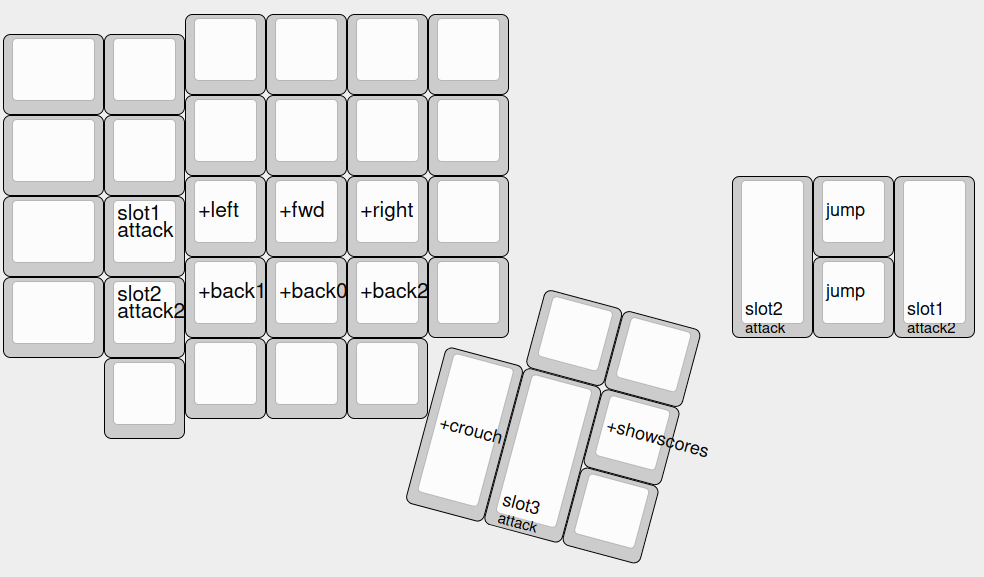
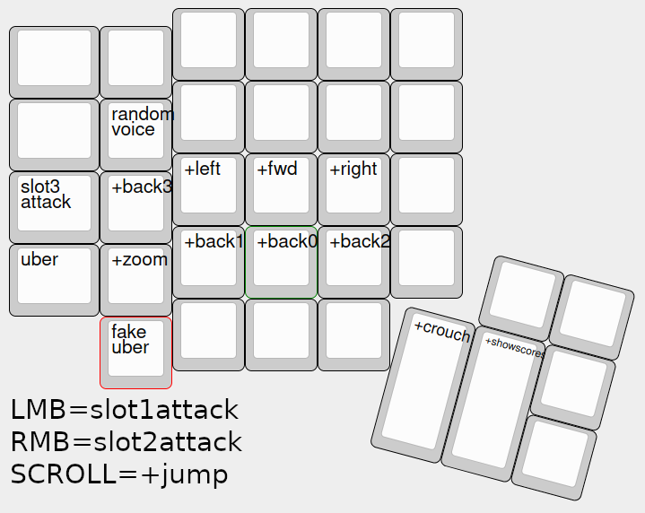

# Installation Instructions

## Cloning the repo

Find where TF2 is installed on your machine. This should be something along the lines of
`.../Steam/steamapps/common/Team Fortress 2/tf`. We will refer to this directory as simply `tf`.

Clone this repo into `tf/custom`. All subdirectories under `tf/custom` have a directory structure that
mirrors `tf/`, e.g. official maps are stored in `tf/maps`, and maps you download should be stored in
`tf/custom/*/maps`. You can have as many directories under `tf/custom` as you'd like, and these
installation instructions will create a few of these.

From here on, we'll assume that this repo has been cloned into `tf/custom/tf2config`, and will
abbreviate this path to `tf2config`.

## (Optional, recommended for later) Getting mastercomfig

Mastercomfig is an "FPS" config intended to boost frame rates on machines that can't run TF2
particularly well. We're not super interested in the frame rate improvements, but TF2 loads
incredibly slowly even on modern machines due to inefficiencies in the source engine, and
mastercomfig includes a few things that speed this up a bit.

I don't recommend installing mastercomfig while getting set up with this repo, for the reason that
it installs `.vpk`'s, which are basically opaque packages of directories such as
`tf/custom/tf2config`, and installing it means that you can't change a lot of settings "normally"
via the in-game menus anymore (because it will override them).

If you choose not to install mastercomfig, then you need to move the scripts in
`tf2config/cfg/user` into `tf2config/cfg`. The `user` directory exists only to
appease mastercomfig. If you do choose to install it, then you need to make a symlink
`tf/cfg/user -> tf2config/user`. Mastercomfig will apparently only look in `tf/cfg/user` to find the
autoexec and class-specific scripts.

Note that this repo has a file `tf2config/cfg/user/modules.cfg` which is used to configure
mastercomfig. `aa_msaa=off` and `outlines=high` are overrides that may reduce your desired graphics
settings, and you may want to remove them to just let mastercomfig choose what settings to use for
those.

## Set launch options

Add the following to your launch options:

```
-novid -nojoy -nosteamcontroller -nohltv -particles 1 -precachefontchars
```

These have been taken straight from mastercomfig, see
[here](https://docs.mastercomfig.com/en/latest/customization/launch_options/) for extra launch
options you may want to add.

## Clone FlawHud

Go [here](https://github.com/CriticalFlaw/FlawHUD) and clone this repo such that it can be found at
`tf/custom/flawhud`. One oddity about subdirectories under `tf/custom` is that apparently they must
not start with an uppercase letter, so `tf/custom/FlawHUD` apparently doesn't work.

Once you've done this, there's an optional step where there should be a patch file found at
`tf2config/flawhud.patch`. You can simply `git apply` it against `tf/custom/flawhud` (and maybe
resolve any conflicts that come up) to get a few of my custom changes. 

A list of (possibly out-of-date) changes that I've made:

- Used some commented out lines (seems like this is an intended optional change maybe?) to make it
  so that low ammo has the text in red rather than making the background red.
- Hid the "player model" that's shown on the bottom left which shows your player model. The player
  model gives you the minimally useful information of which team you're on and maybe which gun you
  have out, but it looks very out-of-place in this "minimal" HUD.
- Centered the killfeed. The killfeed gives pretty important information, and so should be centered.
  It has been moved to the location it would be in as if your screen were 4:3, regardless of actual
  screen width.
- Killfeed shows up to 8 entries rather than 5. More information is better than less information (up
  to a degree, but 8 is the max and is fine).
- Moved medic HUD elements so that from the crosshair down the elements are: ubercharge percentage
  in a small font but bright green, primary target ID (the health of the friendly you're looking
  at), secondary target ID (the health and ammo of the person you're healing), and then ubercharge
  bar.

## Make changes to `autoexec.cfg` and `reset.cfg`

The file `autoexec.cfg` is (as its name suggests) auto executed by the game upon launch. The file
`reset.cfg` has otherwise no special meaning, it's just a `.cfg` that can be executed in the TF2
console (you can run `exec reset` in the in-game console and it'll execute the script, just like
anything else you put in `tf/cfg` or `tf/custom/*/cfg`). It is, however, a very necessary script,
because there are also a bunch of class-specific scripts, `scout.cfg`, `medic.cfg`, and `pyro.cfg`
which are executed *when you switch to said class* in game. The point of `reset.cfg` is effectively
to undo any configuration in those class-specific scripts, to get us to a blank slate. As a result,
note that it is sourced and executed via `exec reset` at the end of `autoexec.cfg`, and at the start
of all class-specific scripts. If you were to want to add another class-specific script, you would
`exec reset` at the beginning. If you were to add any configuration in a class-specific script not
already captured by `reset.cfg`, you should reset it in `reset.cfg` and then make your
class-specific change. Specifically, I recommend the organizational scheme that any key that you
want to bind in a class-specific way be bound to an alias in `reset.cfg`, and then to redefine the
alias in class-specific scripts.

In terms of changes you should make, the very top stanza of `autoexec.cfg` needs to be edited to
include your sensitivity (tf2 uses source engine sensitivity, you can use any sensitivity converter
website to convert from other games), and a "fake zoom" sensitivity. The value that's currently
there results in 19.2cm/360 with an 800 DPI mouse, for reference. The "fake zoom" sensitivity is the
focal-length-scaled sensitivity from 90 FOV to 75 FOV. 90 FOV is the largest FOV TF2 will allow you
to have, and 75 is the minimum. I believe focal length scaling is simply a multiplicative factor, so
once you've figured out your normal sensitivity, simply scale it by the same amount as the two
values already in the repo and you should have a correctly-scaled sensitivity. The fake zoom
honestly doesn't matter that much anyway, 75 FOV is barely more zoomed in than 90...

Since I'm a DVORAK user, and you probably are not, you should look at any command that starts with
the word `bind` in `autoexec.cfg` and `reset.cfg`, and rebind them. Look at the following picture
for reference:


I'm using a variant of what would be equivalent to ESDF, except moving forward has been moved to the
homerow and moving backwards has been pushed down a row. I also have defined multiple aliases for
moving backwards which allows for changing directions between forward and back without reusing the
same finger, but you don't necessarily need any of this and just use good ol' ESDF. You may even be
able to use WASD, as long as you can find at least 4 buttons that you can press with your pinky. You
define the buttons that you press with the pinky in `autoexec.cfg`. Define `a0` to be the most
reachable pinky key (which is almost certainly A for ESDF users and Control (I mean Capslock) for
WASD users), `a1` to be the next most reachable, etc.

Note that I've only bound two actions to keys pressed by the thumb: crouch and showing the
scoreboard. The fewer players there are, the more important the scoreboard is to track who's alive,
which is to say that it doesn't really matter at all in 12v12. If on a normal keyboard, Spacebar
should be crouch and probably Alt for scoreboard makes sense.

Below are the class-specific bindings in graphical form.
Note that depending on how you defined `a[0-5]`, or even any of the other keys, it'll probably look
somewhat different to these, but you shold get the gist. There are really only two exotic binds that
you can't normally do: `slot[1-3]attack` is a key which switches to a particular slot (primary,
secondary, or melee) if you're not already on that slot, and it will also attack with said weapon.
This makes it so that you don't have to care what you have equipped, since it'll always switch to
the right thing (and if you're already using the right slot, it'll attack). Also `slot2hold` is a
key which, while held, switches to your secondary, but will switch back to whatever weapon you have
previously out upon release. This is useful for the "combo pyro" playstyle, which requires many
switches between flamethrower and the shotgun secondary.

Scout:


Pyro:



The pyro layout is motivated by the following:

- The biggest problem for pyro: it uses melee probably more than any other class! The axtinguisher
  is used to combo (light someone on fire for afterburn, hit them to do big damage), and the
  powerjack is often switched to-and-from to get its speed boost for jumps. If you're willing to
  sacrifice a bit of melee ability, a better layout would be to bind `a0=slot1attack` and
  `m1=slot2attack`. This has the advantage that you can hold `a0` to attack with the flamethrower,
  and you can still switch between the flamethrower and the secondary quickly; but since `a0` is
  held to attack with the flamethrower, switching to melee is slower.
- Airblasting requires `+attack2` to be bound to a mouse button. An alternative may be to use
  `slot1attack2` instead, but the detonator (which is a secondary) requires `+attack2` for det-jumps
  as well.
- Pyro can detonator jump, but is also the class that probably benefits the most from bunny hopping,
  so jump is aliased to a button for det-jumps.

Medic:




## Probably delete `scripts/tf_weapon*.txt`

I have a bunch of files in `tf2config/scripts` which redefine crosshairs in game. They probably only
work specifically on my 3840x1600 ultrawide monitor, because I created the images myself as 512x512
pngs and converted them to `.vtf` (Valve texture files) and am using them unscaled. You may be able
to fiddle with the `cl_crosshair_scale` variable to scale my crosshairs up or down to the correct
size. You'll know the size is correct if you choose scout, turn fixed spread on, shoot at a wall,
and the bullet hole decals line up exactly with the edges of the cross and the four dots on the
diagonal.

Alternatively, just remove all of these files, and you'll go back to using default crosshairs that
the game ships with.
